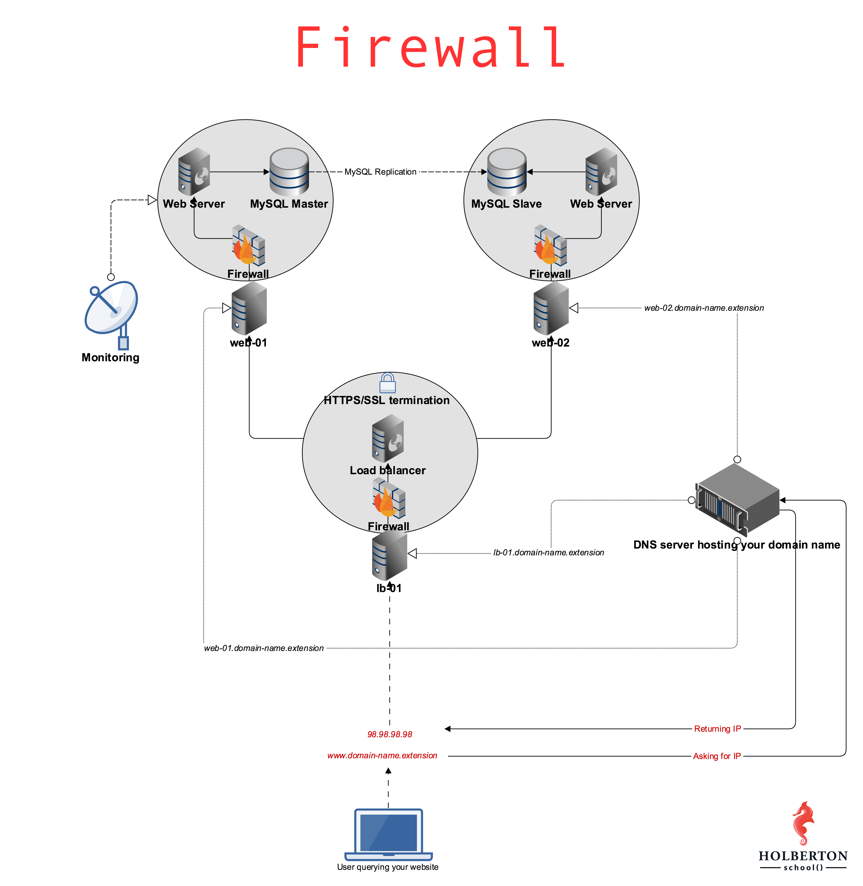

# 0x13. Firewall

In computing, a firewall is a network security system that monitors and controls incoming and outgoing network traffic based on predetermined security rules.[1][2] A firewall typically establishes a barrier between a trusted network and an untrusted network, such as the Internet.

## TASK 0

Let’s install the ufw firewall and setup a few rules on web-01.

Requirements:

The requirements below must be applied to web-01 (feel free to do it on lb-01 and web-02, but it won’t be checked)
Configure ufw so that it blocks all incoming traffic, except the following TCP ports:

- 22 (SSH)
- 443 (HTTPS SSL)
- 80 (HTTP)

Share the ufw commands that you used in your answer file

## TASK 1

Firewalls can not only filter requests, they can also forward them.

Requirements:

- Configure web-01 so that its firewall redirects port 8080/TCP to port 80/TCP.
- Your answer file should be a copy of the ufw configuration file that you modified to make this happen

